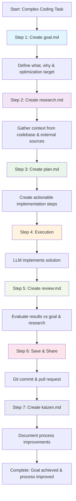

# Simple Agentic Coding Flow

A structured workflow for tackling complex coding tasks with AI agents.

## Core Principles

### Work in Small Chunks
Breaking work into manageable pieces makes review significantly easier. Large blocks of LLM-generated work are difficult to validate and debug. Keep each iteration focused and reviewable.

### Shift-Left Review
Catch issues as early as possible in the workflow. It's far easier to identify problems during goal definition, research, or planning than after full implementation. Early detection prevents costly rework.

### Continuous Prompt Improvement (Kaizen)
The workflow is only as good as the prompts that drive it. Regularly refine and improve prompts based on results and learnings from each iteration.

## Overview

This workflow breaks down complex coding tasks into seven distinct phases, each with a specific purpose and output. By separating goal articulation, research, planning, execution, review, sharing, and process improvement, we ensure both high-quality results and continuous learning.

## The Steps

Note, after each step, consider whether to compress/reset/extend the context.

### 1. Goal Definition (`/sacf-goal`)
Create a 1-2 paragraph document that articulates in plain English what we aim to accomplish. This establishes clear intent and success criteria before any technical work begins.

**Critical Elements**:
- **Optimization Target**: Clearly state what the LLM should optimize for (simplicity, clarity, speed, performance, extensibility, etc.)
- **Right-Sized Scope**: Ensure the work is appropriately scoped - our biggest risk in 2025 is getting "over our skis" with overly ambitious chunks

**Purpose**: Define the "what" and "why" without getting into implementation details.
**Output**: `goal.md`

### 2. Research & Context (`/sacf-research`)
Gather all pertinent context necessary for the LLM coding agent in a single markdown file. This research is informed by the goal and may include:
- Relevant codebase context
- External best practices and documentation
- Links to other relevant markdown files
- Domain-specific knowledge

**Purpose**: Provide comprehensive context while avoiding any implementation guidance.
**Output**: `research.md`

### 3. Implementation Planning (`/sacf-plan`)
Create a step-by-step plan that, when given to a coding agent, can be used for fulfilling the goal. The plan references and builds upon the research phase.

**Purpose**: Transform research into actionable implementation steps.
**Output**: `plan.md`

### 4. Execution (`/sacf-execute`)
Execute the work via an LLM coding assistant following the established principles: work in small, reviewable chunks and maintain focus. An optional `execute.md` file may be maintained for the LLM to "save its work," but avoid creating unnecessary artifacts.

**Purpose**: Implement the solution following the plan with LLM assistance.
**Output**: Code changes (optional `execute.md` or `wip.md`)

### 5. Review (`/sacf-review`)
Review the result of the LLM agent's work against the original plan. Evaluate how well we accomplished the goal and stayed true to the research findings.

**Purpose**: Assess quality and alignment with original intent.
**Output**: `review.md`

### 6. Save & Share (`/sacf-commit`)
Save and share the work via git commit and pull request. No singular markdown artifact is created for this step - focus on proper version control and collaboration.

**Purpose**: Preserve work and enable team collaboration.
**Output**: Git commit and pull request

### 7. Process Improvement (`/sacf-kaizen`)
Review the entire process for potential improvements, with special focus on prompt refinement. Document what worked well, what didn't, and how the workflow and prompts could be enhanced for future iterations.

**Purpose**: Continuous improvement of the agentic coding workflow and prompt quality.
**Output**: `kaizen.md`

## Workflow Diagram

## Benefits

- **Clarity of Purpose**: Explicit goals with optimization targets prevent scope creep
- **Research-Driven Decisions**: Context gathering leads to better architectural choices
- **Implementation-Agnostic Research**: Objective analysis without premature optimization
- **Actionable Planning**: Plans reference research findings to justify decisions
- **LLM-Optimized**: Provides clear context and step-by-step guidance for AI agents
- **Quality Assurance**: Built-in review step ensures results align with original intent
- **Continuous Improvement**: Kaizen step builds organizational learning
- **Right-Sized Work**: Focus on appropriately scoped chunks prevents getting "over our skis"

## SACF Guide Command

For workflow navigation and onboarding, an experimental guide command is available:

### `/sacf-guide-experimental`
**Purpose**: Interactive guidance through the SACF workflow
**Use Cases**:
- **Workflow Onboarding**: New team members learning the SACF process
- **Step Navigation**: Quick reference for command syntax and next steps
- **Context Management Decisions**: Guidance on when to compress/reset/extend context

The guide serves as a "workflow navigator" rather than just documentation, helping ensure adherence to the complete 7-step process while reducing cognitive load.

## Key Success Factors

- **Context Management**: After each step, consider compressing or resetting context to maintain focus and prevent information overload
- **Clear Optimization Targets**: Always specify what the LLM should optimize for
- **Early Issue Detection**: Leverage shift-left review to catch problems before implementation
- **Prompt Evolution**: Continuously refine prompts based on kaizen learnings
